# Frontend Exercises

## 1. learnyouhtml

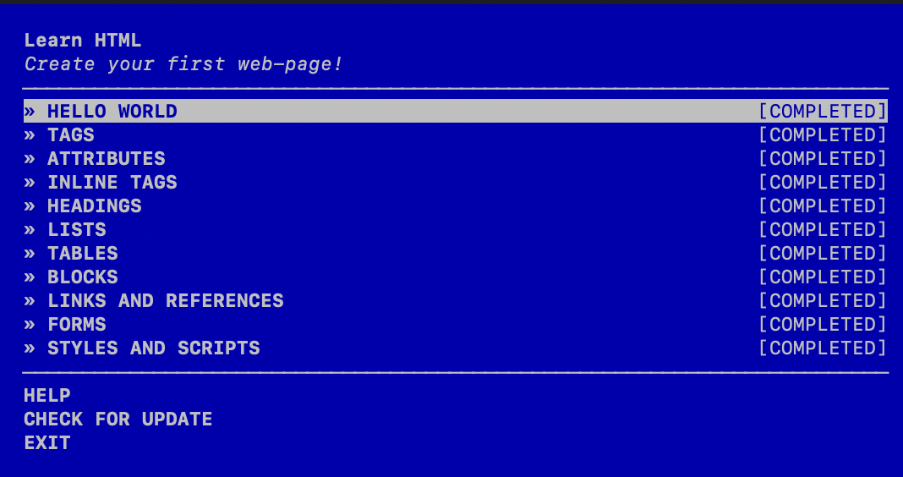

## 2. portfolio

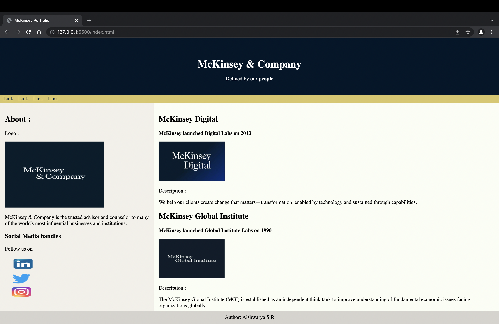

## 3. eShop

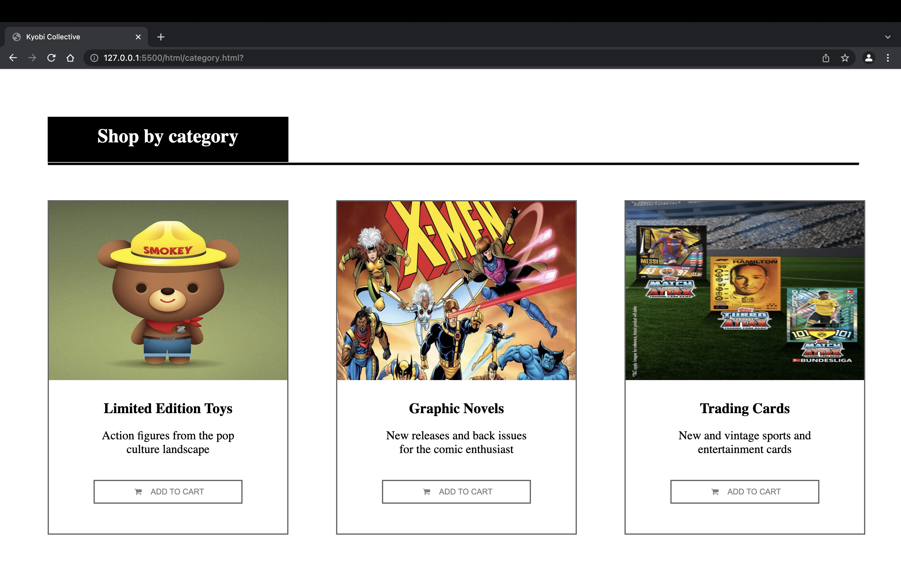

## 4. Flexbox Froggy

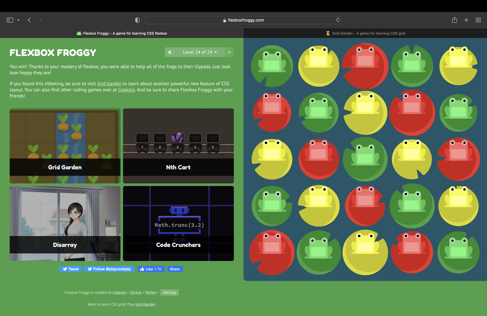

## 5. Tic-Tac-Toe

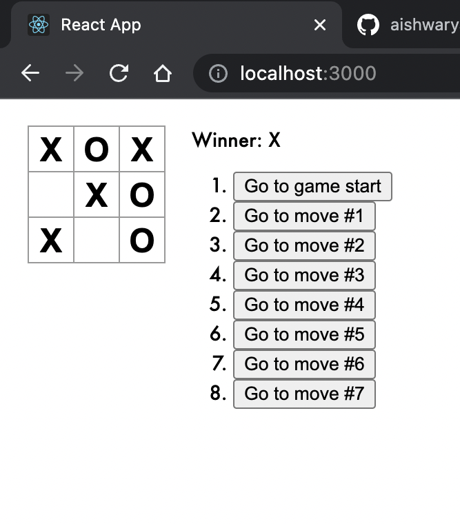

## 6. Tracker

## 7. Todo-app

### 1. List

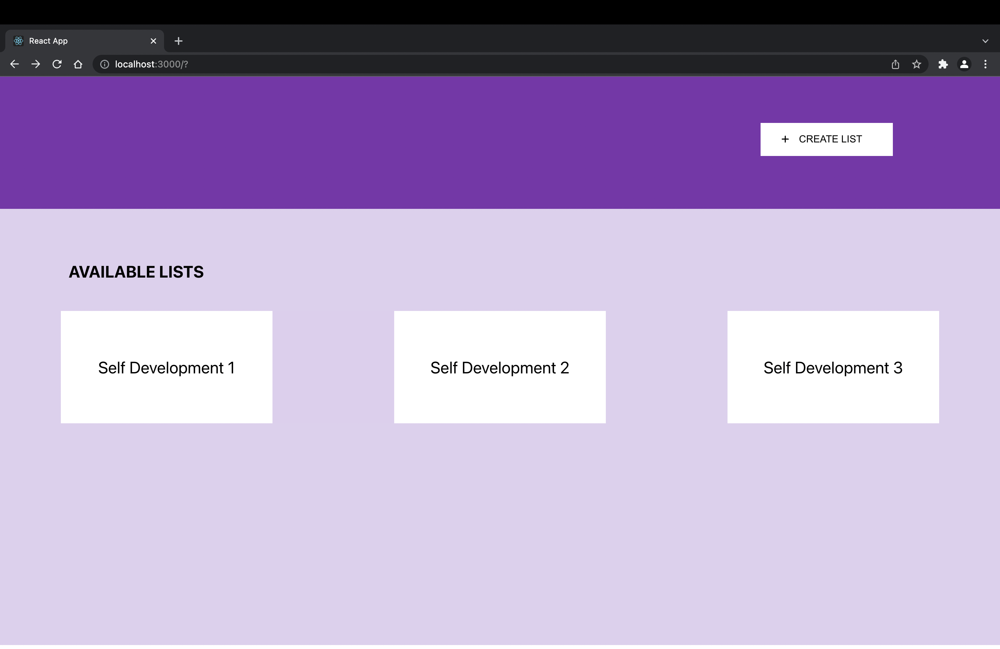

### 2. Create new list

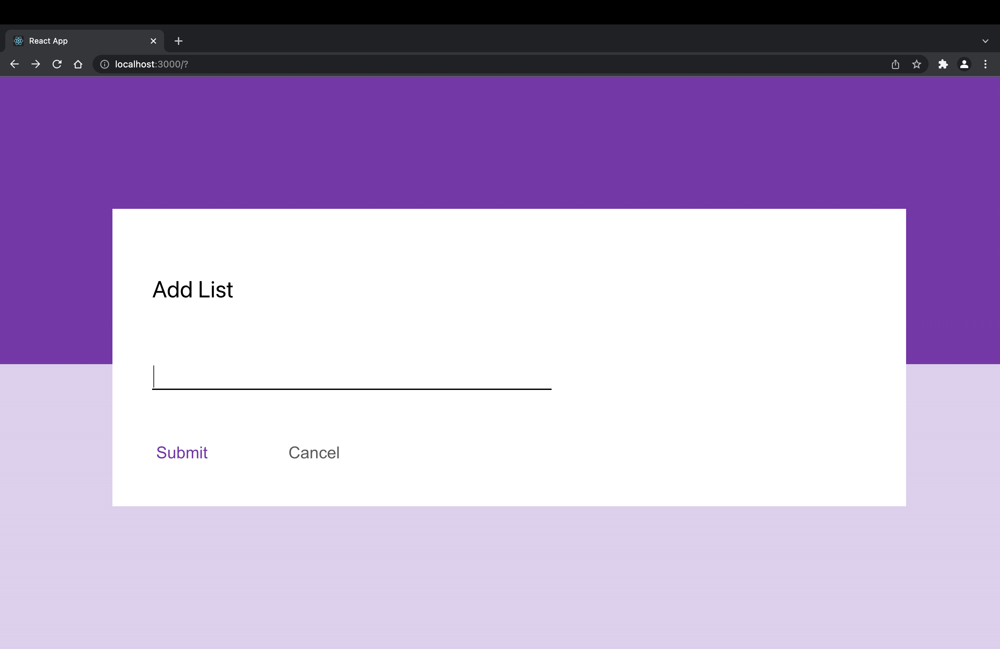

### 3. Task

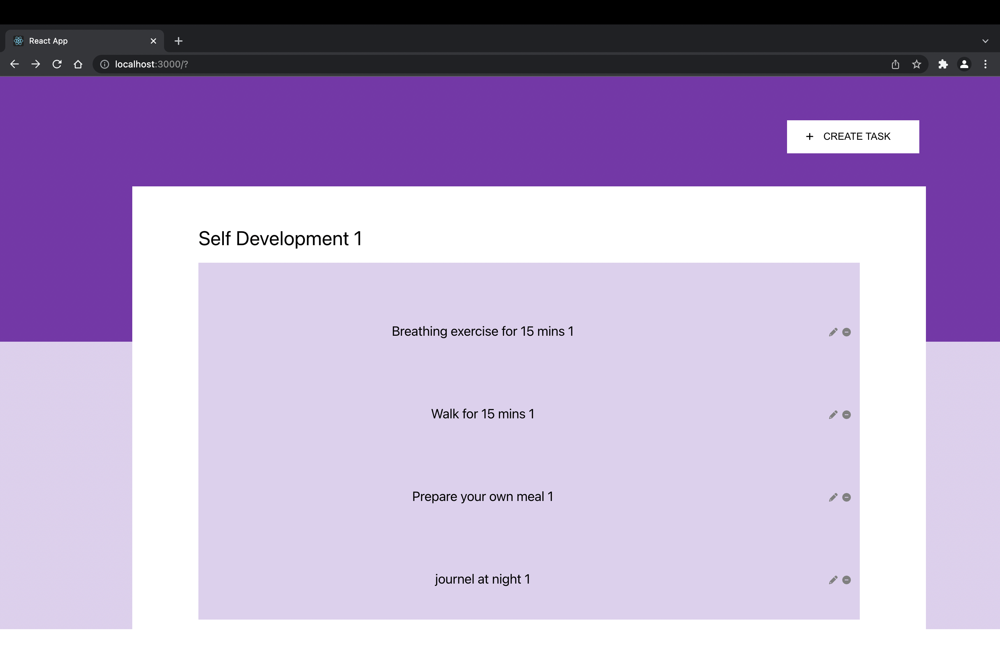

### 4. Create new task

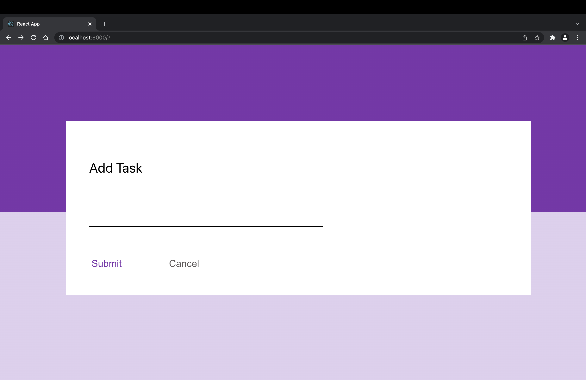

### 5. Update task

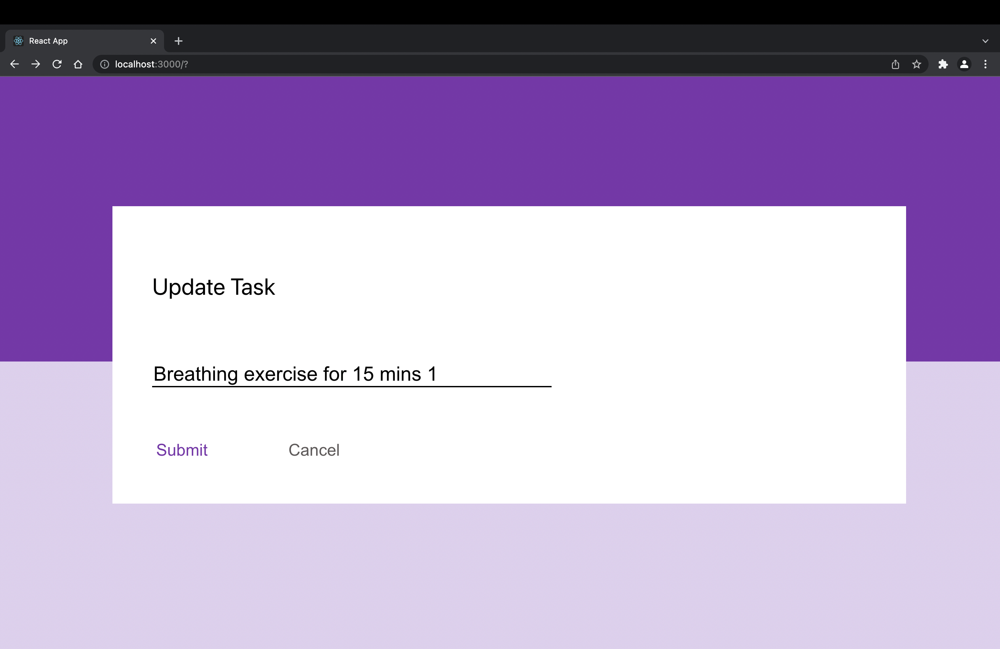

### 6. Delete task

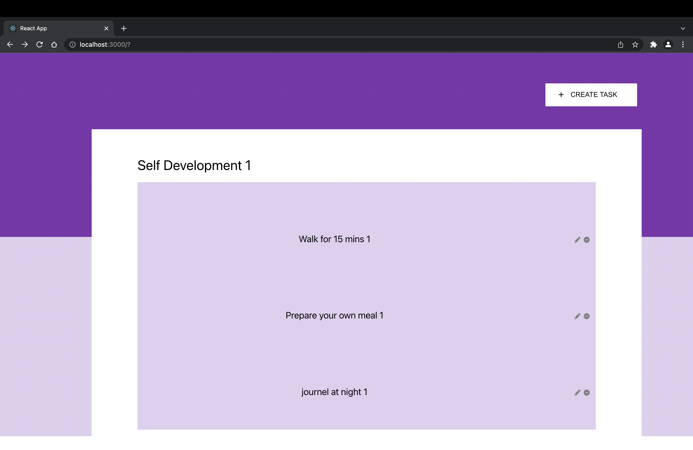
